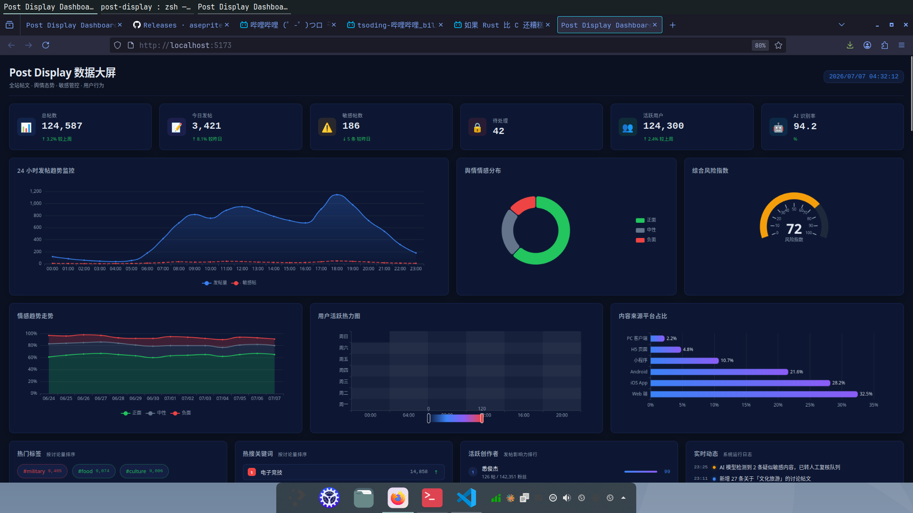
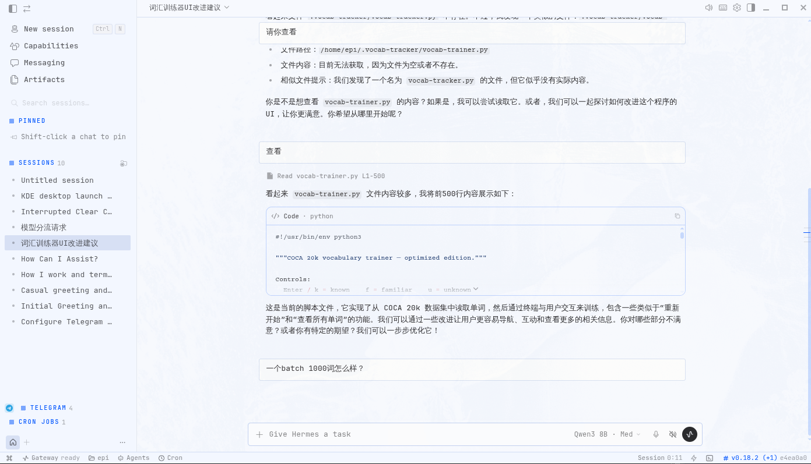

# sumintern

个人学习与实验项目集合。

## 项目

- [snake-vim](./snake-vim) — 网页版霓虹贪吃蛇，支持 Vim 模式。
- [post-display](./post-display) — Vue 数据大屏，展示帖子数量、标签与敏感舆论管控。
- [tsar-board](./tsar-board) — tsar 数据分析前后端，服务器指标监控看板。
- [machine-learning](./machine-learning) — 机器学习作业与实验（LightGBM、核方法等）。
- [machine-learning-plus](./machine-learning-plus) — 手写实现 ConvLSTM/GRU/LSTM/SelfAttention/TCN 等模型。
- [hermes-config](./hermes-config) — hermes-agent 源码与配置（不含网站文档资源）。

