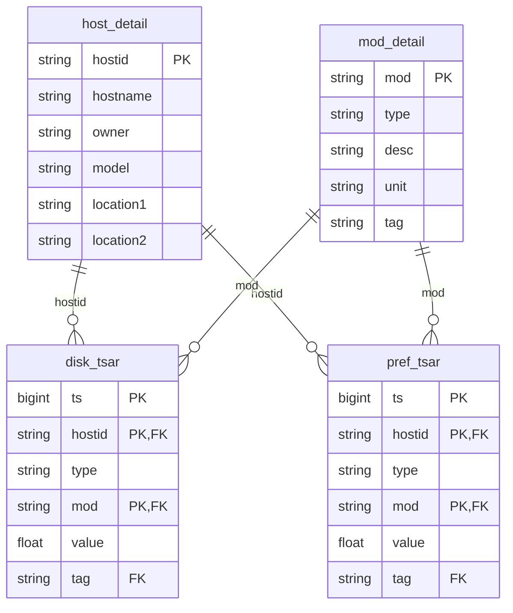

# ER 关系图

## 表结构说明

### host_detail（主机明细表）
| 字段 | 类型 | 说明 |
|------|------|------|
| hostid | string | 主机编号（PK） |
| hostname | string | 主机名 |
| owner | string | 负责人 |
| model | string | 服务器型号 |
| location1 | string | 机房 |
| location2 | string | 机柜位置 |

### mod_detail（指标字典表）
| 字段 | 类型 | 说明 |
|------|------|------|
| mod | string | 指标名（PK） |
| type | string | 指标类型（disk / pref） |
| desc | string | 指标描述 |
| unit | string | 单位 |
| tag | string | 分组标签 |

### disk_tsar（磁盘时序数据表）
| 字段 | 类型 | 说明 |
|------|------|------|
| ts | bigint | 时间戳（PK, epoch ms） |
| hostid | string | 主机编号（PK, FK -> host_detail） |
| type | string | 类型（disk） |
| mod | string | 指标名（PK, FK -> mod_detail） |
| value | float | 指标值 |
| tag | string | 分组标签（FK -> mod_detail.tag） |

### pref_tsar（性能时序数据表）
| 字段 | 类型 | 说明 |
|------|------|------|
| ts | bigint | 时间戳（PK, epoch ms） |
| hostid | string | 主机编号（PK, FK -> host_detail） |
| type | string | 类型（pref） |
| mod | string | 指标名（PK, FK -> mod_detail） |
| value | float | 指标值 |
| tag | string | 分组标签（FK -> mod_detail.tag） |

## 关系总结

- `host_detail` 与 `disk_tsar`、`pref_tsar` 是一对多关系（通过 hostid）
- `mod_detail` 与 `disk_tsar`、`pref_tsar` 是一对多关系（通过 mod）
- `disk_tsar` 和 `pref_tsar` 是事实表，`host_detail` 和 `mod_detail` 是维度表
