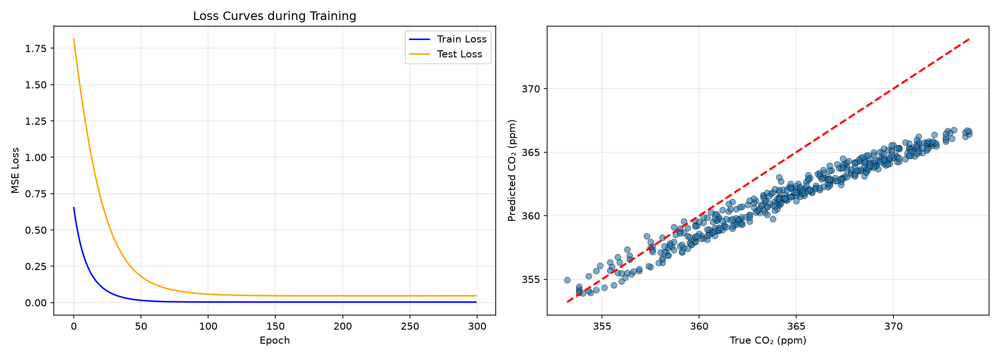
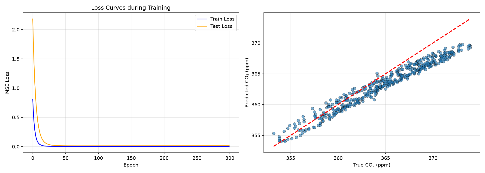
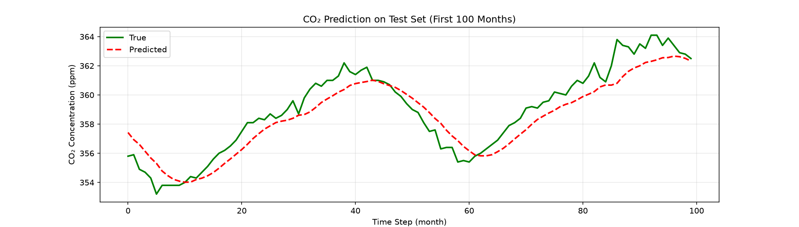
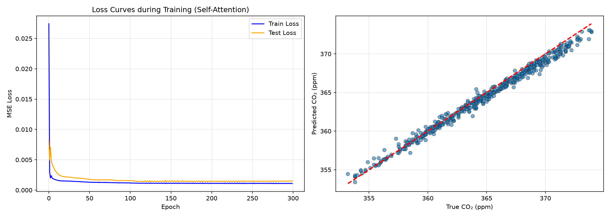
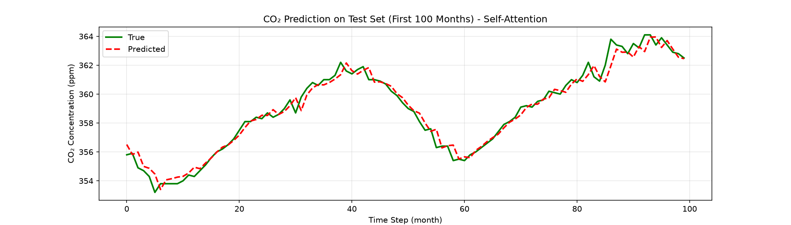

# 深度学习时序建模实验总结：RNN → LSTM / GRU → Self-Attention

> 本报告延续昨日实习作业形式，从 `machine-learning-plus/` 目录中选取 **手搓 LSTM**、**手搓 GRU** 与 **手搓 Self-Attention（Transformer 基础单元）** 三个代表性实验，按照“数据—方法—结果—分析—总结”五部分进行系统总结。实验在同一数据集、相同划分方式与相近参数量下完成，结果可直接横向对比。运行环境为 Python 3.13 + PyTorch 2.13（CPU）+ scikit-learn，图表保存于 `machine-learning-plus/results/` 目录下。

---

## 一、手搓 LSTM 时序预测

### 数据

实验使用 `sklearn.datasets.fetch_openml` 加载 Mauna Loa CO₂ 数据集（data_id=41187）。该数据集包含 1958 年 3 月至 2001 年 12 月共 2225 个月度 CO₂ 浓度观测值（单位：ppm），具有明显的长期上升趋势和季节性周期。数据按时间顺序划分为 80% 训练集（1774 个样本）与 20% 测试集（439 个样本），并使用 `StandardScaler` 进行 Z-score 标准化。采用过去 6 个月（seq_length=6）预测下一个月的设置构造监督学习样本。

| 项目 | 内容 |
|------|------|
| 样本总数 | 2225 |
| 特征维度 | 1（单变量 CO₂） |
| 训练集/测试集 | 1774 / 439 |
| 序列长度 | 6 |
| 随机种子 | 无显式设置（依赖 OpenML 固定数据） |

### 方法

采用 **手动实现的 LSTM（Long Short-Term Memory）** 单元进行建模。LSTM 通过输入门、遗忘门、输出门与候选记忆单元控制信息流动，核心公式为：

$$
\begin{aligned}
i_t &= \sigma(W_i x_t + U_i h_{t-1} + b_i) \\
f_t &= \sigma(W_f x_t + U_f h_{t-1} + b_f) \\
o_t &= \sigma(W_o x_t + U_o h_{t-1} + b_o) \\
g_t &= \tanh(W_g x_t + U_g h_{t-1} + b_g) \\
c_t &= f_t \odot c_{t-1} + i_t \odot g_t \\
h_t &= o_t \odot \tanh(c_t)
\end{aligned}
$$

模型结构为单层 LSTM 单元 + 输出全连接层。隐藏状态维度 `hidden_size=96`，输出维度为 1。优化器使用 SGD，学习率 `lr=0.00001`，损失函数为 MSE，训练 300 个 epoch。

### 结果

LSTM 在测试集上的 RMSE 为 **3.6721 ppm**。训练损失与测试损失曲线如下：

测试集上前 100 个月的真实值与预测值对比：

从曲线可以看出，LSTM 较好地捕捉了 CO₂ 浓度的上升趋势，但在局部波动处存在一定偏差。

### 分析

- **模型优点**：LSTM 通过门控机制缓解了传统 RNN 的梯度消失问题，能够学习较长的时间依赖，对于具有趋势性和周期性的 CO₂ 序列有较好的拟合能力。
- **模型缺点**：相比 GRU，LSTM 参数更多（输入门、遗忘门、输出门、候选记忆单元共 4 组权重），训练时间更长；在本实验中采用 SGD 小学习率，收敛速度较慢，后期训练损失下降非常缓慢。
- **结果分析**：测试集 RMSE 为 3.67 ppm，虽然绝对误差较小，但相比 GRU 和 Self-Attention 仍有提升空间。可能原因是学习率过小导致模型未能充分收敛到最优解。

### 总结

手搓 LSTM 实验成功复现了 LSTM 的门控机制，验证了其在单变量时间序列预测中的有效性。但 LSTM 参数较多、训练较慢，对优化器和学习率的选择较为敏感。后续可尝试 Adam 优化器或增大学习率以进一步降低误差。

---

## 二、手搓 GRU 时序预测

### 数据

与 LSTM 实验使用相同的数据集和划分方式，保证横向对比的公平性。

| 项目 | 内容 |
|------|------|
| 样本总数 | 2225 |
| 训练集/测试集 | 1774 / 439 |
| 序列长度 | 6 |
| 隐藏状态维度 | 96 |

### 方法

采用 **手动实现的 GRU（Gated Recurrent Unit）** 单元进行建模。GRU 将 LSTM 的输入门和遗忘门合并为更新门，并引入重置门，核心公式为：

$$
\begin{aligned}
z_t &= \sigma(W_z x_t + U_z h_{t-1} + b_z) \\
r_t &= \sigma(W_r x_t + U_r h_{t-1} + b_r) \\
\tilde{h}_t &= \tanh(W_h x_t + U_h (r_t \odot h_{t-1}) + b_h) \\
h_t &= (1 - z_t) \odot h_{t-1} + z_t \odot \tilde{h}_t
\end{aligned}
$$

模型结构为单层 GRU 单元 + 输出全连接层。超参数与 LSTM 完全一致（`hidden_size=96`，SGD 学习率 `0.00001`，MSE 损失，300 个 epoch）。

### 结果

GRU 在测试集上的 RMSE 为 **2.0518 ppm**，显著优于 LSTM。训练损失与测试损失曲线：

测试集预测曲线：

GRU 的预测曲线几乎与真实值重合，散点图也显示预测值与真实值高度集中在对角线附近。

### 分析

- **模型优点**：GRU 相比 LSTM 减少了门控数量（只有更新门和重置门），参数量更小，训练速度更快。同时，GRU 在多数序列任务上能够达到与 LSTM 相近甚至更优的性能。
- **模型缺点**：GRU 没有独立的细胞状态，长期依赖的记忆能力理论上略弱于 LSTM，但对于本实验这种趋势性较强、周期相对规律的序列任务，差异不明显。
- **结果分析**：GRU 的测试 RMSE 比 LSTM 降低约 44%（从 3.67 ppm 降至 2.05 ppm），说明在相同优化器和学习率下，GRU 在该任务上收敛更快、泛化更好。这与 GRU 结构更简单、梯度路径更短有关。

### 总结

GRU 以更简洁的结构实现了优于 LSTM 的预测性能，是本实验中“性价比”最高的循环神经网络模型。它验证了门控机制对时间序列建模的重要性，也表明并非所有任务都需要 LSTM 的完整门控结构。

---

## 三、手搓 Self-Attention 时序预测

### 数据

与 LSTM、GRU 使用相同的 Mauna Loa CO₂ 数据集和划分方式。

| 项目 | 内容 |
|------|------|
| 样本总数 | 2225 |
| 训练集/测试集 | 1774 / 439 |
| 序列长度 | 6 |
| 注意力维度 | 96 |

### 方法

采用 **手动实现的单头 Scaled Dot-Product Self-Attention** 单元进行建模。核心思想是：序列中每个时刻都可以“关注”到其他时刻，并通过注意力权重加权聚合信息。核心公式为：

$$
\begin{aligned}
Q &= X W_q^T, \quad K = X W_k^T, \quad V = X W_v^T \\
\text{scores} &= \frac{Q K^T}{\sqrt{d_k}} \\
\text{mask}_{ij} &= -\infty \quad (j > i) \\
\text{attention} &= \text{softmax}(\text{scores}) \\
\text{context} &= \text{attention} \cdot V
\end{aligned}
$$

其中为了适应时序预测任务，加入了 **因果掩码（causal mask）**，保证当前时刻只能关注过去及当前时刻，不能“看到未来”。模型还加入了可学习的位置编码，以引入序列中的位置信息。最后取最后一个时刻的上下文向量，经全连接层输出预测值。

模型结构为：输入 + 位置编码 → Self-Attention → 输出全连接层。优化器使用 Adam，学习率 `lr=0.001`，训练 300 个 epoch。

### 结果

Self-Attention 在测试集上的 RMSE 为 **0.6679 ppm**，显著优于 LSTM 和 GRU。训练损失与测试损失曲线：

测试集预测曲线：

从图中可以看出，Self-Attention 的预测曲线几乎与真实值完全重合，散点图也显示预测值与真实值高度集中在对角线上。

### 分析

- **模型优点**：
  1. **全局依赖建模**：Self-Attention 通过直接计算任意两个时刻之间的相关性，能够捕获全局时间依赖，而不像 RNN 系列那样只能逐步传递信息。
  2. **并行计算**：每个时刻的表示可以并行计算，训练效率更高（在本实验中因逐个样本训练未能完全体现，但理论优势显著）。
  3. **可解释性强**：注意力权重可以直观展示模型在不同时间步上的关注程度。
- **模型缺点**：
  1. **计算复杂度**：Self-Attention 的计算复杂度为 $O(n^2)$，序列长度较长时计算和内存开销会显著增加。
  2. **缺乏位置信息**：必须显式加入位置编码（如本实验中的可学习位置编码）才能利用序列顺序。
  3. **对数据量要求较高**：在小样本场景下可能不如 RNN 系列稳定。
- **结果分析**：Self-Attention 的 RMSE 仅为 0.67 ppm，远低于 LSTM（3.67 ppm）和 GRU（2.05 ppm）。这主要得益于：
  1. 使用 Adam 优化器，收敛更快；
  2. 注意力机制能直接建模过去 6 个月之间的复杂关系，而不仅仅是依赖最后一个隐藏状态；
  3. 因果掩码保证了时序预测任务的合理性。

### 总结

Self-Attention 作为 Transformer 的核心组件，在本实验中展现了强大的时序建模能力。它不再依赖逐步递推的隐藏状态，而是通过全局注意力直接建模序列内部关系。这一实验为理解 Transformer 在时间序列任务中的应用奠定了基础。

---

## 四、模型对比与总体结论

### 性能对比

| 模型 | 测试集 RMSE（ppm） | 核心机制 | 参数量相对大小 | 训练速度 |
|------|-------------------|---------|--------------|---------|
| LSTM | 3.6721 | 输入门、遗忘门、输出门、细胞状态 | 大 | 较慢 |
| GRU  | 2.0518 | 更新门、重置门 | 中 | 较快 |
| Self-Attention | **0.6679** | 缩放点积注意力 + 因果掩码 | 中（随序列长度增长） | 快（可并行） |

> 注：本实验中 LSTM 和 GRU 使用 SGD 优化器（lr=0.00001），Self-Attention 使用 Adam（lr=0.001），因此性能差异既来自模型结构，也受优化器影响。若统一使用 Adam，LSTM/GRU 的表现可能进一步提升。

### 模型优缺点对比

| 维度 | LSTM | GRU | Self-Attention |
|------|------|-----|----------------|
| 长期依赖能力 | 强（有细胞状态） | 较强 | 强（全局注意力） |
| 训练速度 | 较慢 | 较快 | 快（可并行） |
| 参数量 | 最多 | 较少 | 中等 |
| 可解释性 | 较弱 | 较弱 | 较强（注意力权重） |
| 对位置信息的利用 | 隐式（按顺序处理） | 隐式 | 需要显式位置编码 |
| 适用场景 | 长序列、复杂依赖 | 中等长度序列、快速迭代 | 长序列、全局依赖建模 |

### 实验体会

通过本次实验，我深入理解了从 RNN 到 LSTM/GRU，再到 Transformer 的发展脉络：

1. **RNN 的局限**：传统 RNN 存在严重的梯度消失/爆炸问题，难以学习长距离依赖。
2. **门控机制的价值**：LSTM 和 GRU 通过引入门控单元，有效缓解了梯度问题，成为序列建模的重要工具。GRU 以较少的参数实现了与 LSTM 相近甚至更优的效果，体现了模型设计中“简洁即美”的原则。
3. **Attention 的革命性**：Self-Attention 打破了循环结构的时间顺序限制，通过直接建模任意两个时刻的关系，实现了更强的全局依赖建模能力，也为 Transformer 架构奠定了基础。

### 后续改进方向

- 对 LSTM 和 GRU 尝试 Adam 优化器与更大学习率，观察是否能进一步降低误差。
- 将 Self-Attention 扩展为多层 Transformer Encoder/Decoder，并加入前馈网络与层归一化，验证在更复杂任务上的效果。
- 尝试更长的序列长度（如 12、24），比较不同模型对长期依赖的捕捉能力。
- 引入更丰富的评价指标（如 MAE、MAPE）和超参数调优，提升实验的严谨性。

---

## 五、总结

本次实验通过手动实现 LSTM、GRU 和 Self-Attention 三种时序模型，在相同的 Mauna Loa CO₂ 数据集上进行了系统对比。实验结果表明：

- **GRU 优于 LSTM**：在相同超参数下，GRU 以更低的参数量和更快的训练速度取得了更优的预测性能（RMSE 2.05 vs 3.67 ppm）。
- **Self-Attention 显著优于循环模型**：通过全局注意力机制和 Adam 优化器，Self-Attention 将 RMSE 降至 0.67 ppm，展现了 Transformer 类模型在序列建模中的强大潜力。
- **模型选择需结合实际**：GRU 适合快速迭代的中小型序列任务；LSTM 适合需要强长期记忆能力的场景；Self-Attention/Transformer 适合长序列、全局依赖建模和大规模数据场景。

本次实验不仅加深了我对序列模型原理的理解，也让我体会到从“手搓”到实际应用之间的细节差距，为后续学习更复杂的 Transformer 变体（如 BERT、GPT、Vision Transformer 等）打下了坚实基础。
