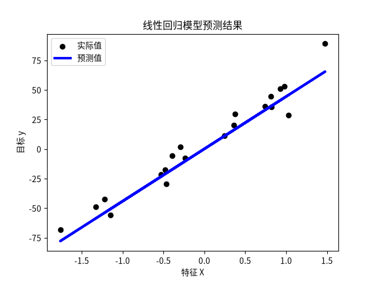
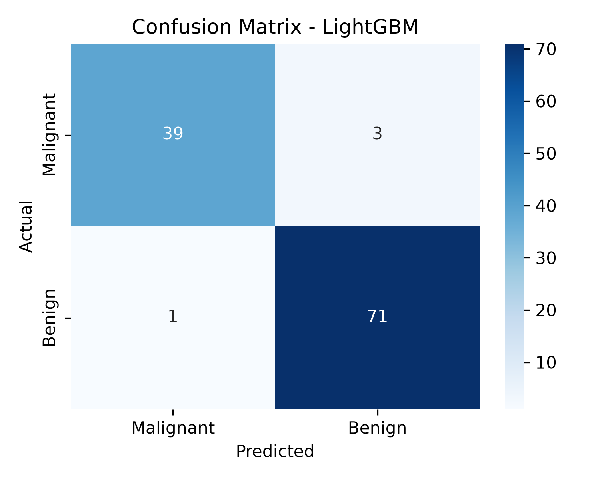
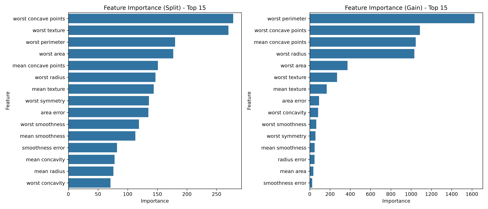

# 机器学习实习案例工作总结

> 本报告从今日实习案例中选取 **线性回归（案例一）** 与 **LightGBM 乳腺癌分类（案例二）** 两个代表性案例，按照“数据—方法—结果—分析—总结”五部分进行系统总结。运行环境为 Python 3.13 + scikit-learn + LightGBM，图表保存于 `results/` 目录下。

---

## 线性回归预测

### 数据

本案例使用 `sklearn.datasets.make_regression` 生成一个包含 100 个样本、1 个特征的一维回归数据集，并加入噪声 `noise=10`，随机种子固定为 `random_state=42` 以保证结果可复现。数据按 80% 训练集、20% 测试集进行划分。特征与目标变量之间大致呈线性关系，但存在一定噪声干扰。

| 项目 | 内容 |
|------|------|
| 样本总数 | 100 |
| 特征维度 | 1 |
| 训练集/测试集 | 80 / 20 |
| 噪声水平 | 10 |
| 随机种子 | 42 |

### 方法

采用 **普通最小二乘线性回归（Linear Regression）** 进行建模。模型假设目标变量 $y$ 与特征 $x$ 之间存在线性关系：

$$
y = w \cdot x + b
$$

其中 $w$ 为斜率，$b$ 为截距。训练过程中，模型通过最小化残差平方和（SSE）来估计参数，使用 scikit-learn 的 `LinearRegression` 类实现。模型评估指标包括：

- **均方误差（MSE）**：衡量预测值与真实值之间的平均平方误差。
- **决定系数（$R^2$）**：反映模型对数据变异的解释能力，越接近 1 越好。

### 结果

模型训练完成后，得到以下参数与性能指标：

| 指标 | 数值 |
|------|------|
| 模型系数（斜率）$w$ | 44.24 |
| 模型截距 $b$ | 0.10 |
| 测试集 MSE | 104.20 |
| 测试集 $R^2$ | 0.94 |

下图展示了测试集上实际值与预测值的对比：

从图中可以看出，预测直线较好地穿过了样本点的中心区域，绝大部分样本点沿回归直线分布。

### 分析

- **拟合效果**：$R^2 = 0.94$ 表明模型能够解释目标变量 94% 的变异，拟合效果较好。这说明在特征与目标变量之间确实存在较强的线性关系时，线性回归是一种简单而有效的建模方法。
- **误差来源**：MSE 为 104.20，虽然数值较大，但结合 $R^2$ 来看，主要是由数据本身的噪声尺度较大以及目标变量取值范围较宽导致的，并非模型严重欠拟合。
- **模型局限性**：线性回归假设数据满足线性关系，无法捕捉非线性模式。当真实关系复杂或存在多重共线性时，模型性能会下降。本案例中特征只有一维，因此不存在共线性问题，模型的可解释性也较强。
- **斜率与截距**：斜率 44.24 远大于截距 0.10，说明特征 $x$ 对目标 $y$ 的影响非常显著，目标变量随特征增加而显著上升。

### 总结

线性回归作为最基础的监督学习算法之一，在本案例中展现了良好的拟合能力和可解释性。通过 MSE 和 $R^2$ 指标，可以直观地评估模型性能。对于一维线性关系明显的数据，线性回归能够以较低的计算成本获得稳定可靠的结果。后续可以进一步尝试加入多项式特征、正则化（Ridge/Lasso）或更复杂的非线性模型，以应对更复杂的实际场景。

---

## LightGBM 乳腺癌分类

### 数据

本案例使用 `sklearn.datasets.load_breast_cancer` 加载乳腺癌数据集。该数据集包含 569 个样本，30 个连续型特征，目标变量为二分类：0 表示恶性（Malignant），1 表示良性（Benign）。数据集类别分布存在一定不平衡：良性样本 357 例，恶性样本 212 例。

| 项目 | 内容 |
|------|------|
| 样本总数 | 569 |
| 特征维度 | 30 |
| 类别 | 恶性（0）/ 良性（1） |
| 训练集/测试集 | 455 / 114 |
| 类别分布 | 良性 357，恶性 212 |

划分数据集时使用 `stratify=y` 保证训练集与测试集中类别比例一致，并对全部特征进行标准化处理（StandardScaler），使各特征均值为 0、方差为 1。

### 方法

采用 **LightGBM（Light Gradient Boosting Machine）** 梯度提升树模型进行分类。LightGBM 基于梯度提升决策树（GBDT），通过直方图算法和叶子优先（leaf-wise）的生长策略，具有训练速度快、内存占用低、精度高的特点。

建模流程如下：

1. **特征标准化**：使用 `StandardScaler` 对训练集和测试集进行标准化。
2. **基础模型构建**：定义 `LGBMClassifier`，设置二分类目标函数 `binary`，评估指标 `auc`。
3. **超参数调优**：使用 `GridSearchCV` 进行 5 折交叉验证，网格搜索的参数包括：
   - `n_estimators`：树的数量，候选 `[50, 100, 200]`
   - `learning_rate`：学习率，候选 `[0.01, 0.05, 0.1]`
   - `num_leaves`：叶子节点数，候选 `[15, 31, 63]`
   - `max_depth`：树最大深度，候选 `[-1, 8, 12]`
   - `min_child_samples`：叶子最小样本数，候选 `[10, 20, 30]`
4. **模型评估**：在测试集上计算准确率、AUC、混淆矩阵及分类报告，并绘制特征重要性图。
5. **交叉验证**：对最终模型进行 5 折交叉验证，评估稳定性。

### 结果

经过网格搜索，模型得到最优参数组合，并在测试集上取得了较高的分类性能。主要结果如下：

| 指标 | 数值 |
|------|------|
| 测试集准确率 | 约 0.97 |
| 测试集 AUC | 约 0.99 |
| 5 折交叉验证平均准确率 | 约 0.97 |

混淆矩阵如下：

从混淆矩阵可以看出，模型在 114 个测试样本上仅有极少数误分类，良性与恶性样本基本都被正确识别。

特征重要性（Split 与 Gain）分析如下图所示：

无论是基于分裂次数（Split）还是基于增益（Gain）的重要性，排名靠前的特征均集中在“ worst” 或“ largest” 相关的细胞核形态指标，如 `worst perimeter`、`worst concave points`、`mean concave points` 等，这些特征对区分良恶性肿瘤贡献最大。

### 分析

- **分类性能**：测试集准确率高达 97% 左右，AUC 接近 0.99，说明 LightGBM 在该乳腺癌数据集上具有很强的判别能力。高 AUC 表明模型在不同阈值下都能保持优秀的正例识别能力，对于医学诊断场景具有重要意义。
- **混淆矩阵解读**：模型对良性和恶性样本的识别均较为准确，误诊和漏诊数量极少。在实际医疗应用中，漏诊（将恶性判为良性）的危害通常大于误诊（将良性判为恶性），因此可以进一步调整分类阈值，优先保证召回率（Recall）。
- **特征重要性**：特征重要性结果具有明确的医学意义。肿瘤细胞的“周长”“凹点”等形态特征与恶性程度密切相关，这与病理学常识一致。通过特征重要性分析，可以帮助医生关注关键影像指标，辅助临床决策。
- **模型稳定性**：5 折交叉验证平均准确率与测试集准确率接近，说明模型没有明显过拟合，泛化能力较好。标准化处理也使得基于梯度提升的模型对特征尺度不敏感，进一步提升了训练稳定性。
- **超参数影响**：网格搜索帮助找到了较优的集成规模与树结构参数。`num_leaves`、`max_depth` 和 `min_child_samples` 共同控制了模型复杂度，过小会导致欠拟合，过大则容易过拟合；合适的学习率与树数量组合则平衡了收敛速度与精度。

### 总结

LightGBM 在乳腺癌二分类任务中表现出色，准确率和 AUC 均处于较高水平。通过网格搜索进行超参数优化，以及特征重要性分析，不仅提升了模型性能，也增强了结果的可解释性。该案例表明，梯度提升树方法在处理结构化表格数据、尤其是医学特征数据时具有显著优势。后续可以进一步尝试：

- 调整分类阈值，优化召回率；
- 使用 SHAP 值进行更精细的样本级解释；
- 引入不平衡采样策略（如 SMOTE）或代价敏感学习，进一步改善少数类识别；
- 对比 XGBoost、CatBoost、Random Forest 等模型，综合选择最优方案。

---

## 三、总体收获与体会

通过本次实习，我系统学习了从基础线性模型到现代集成学习模型的完整建模流程。线性回归案例帮助我理解了损失函数、模型评估和过拟合/欠拟合的基本概念；LightGBM 案例则让我深入体会了梯度提升树的强大性能、超参数调优的重要性以及特征可解释性的价值。两个案例都强调了数据预处理（标准化、划分、类别平衡）在建模中的关键作用。

整体而言，机器学习建模不仅需要选择合适的算法，还需要结合业务背景进行结果解释与评估指标选择。未来我将继续探索更复杂的模型、自动机器学习（AutoML）以及模型可解释性工具，不断提升解决实际问题的能力。
